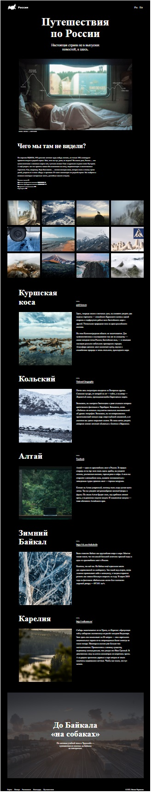

<h1 aligne="center">Проект: Путешествие по России</h1>

Одностраничный статический сайт.

Создан в качестве практической работы для "Яндекс Практикум" по спринту
"Адаптивная вёрстка и работа с макетом".

В работе соблюдены все требования. Сформирована файловая структура проекта по правилам Nested БЭМ.
К сайту подключены шрифты, также шрифты сглажены.

Страница сверстана по макету из «Фигмы» и адаптирована под следующие размеры устройств:

<ul>
  <li>от 1280 пикселей — от стандартных ноутбуков и до бесконечности,</li>
  <li>от 1024 и до 1280 — для небольших ноутбуков,</li>
  <li>от 768 и до 1024 пикселей — от вертикального до горизонтального положения планшета,</li>
  <li>от 320 и до 768 пикселей — от смартфона до вертикального положения планшета.</li>
</ul>

